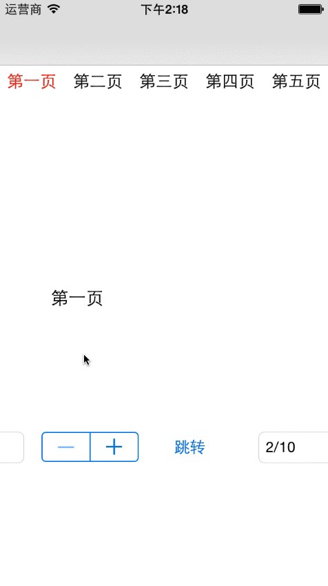

# ContainerViewController
A ContainerViewController Demo

####1. Getting Started
1. Create a `DemoViewController` as `ContainerViewController`'s subclass. This class is a root class.
2. Create a `DemoChildViewController`, this class custom by yourself.
3. Create a `DemoModelController` as `BaseModelController`'s subclass. This class is a model class.

 `BaseModelController` has 2 functions.

 ``` objective-C
 - (instancetype)initWithId:(NSString *)idInStoryBoard;
 ```
 you can initialize `titleArray` in this function.

 ```objective-C
 - (UIViewController *)viewControllerAtIndex:(NSUInteger)index storyboard:(UIStoryboard *)storyboard;
 ```
 return your `DemoChildViewController` in this function, this ViewController will added in `ContainerViewController`.

####2. Screenshot

